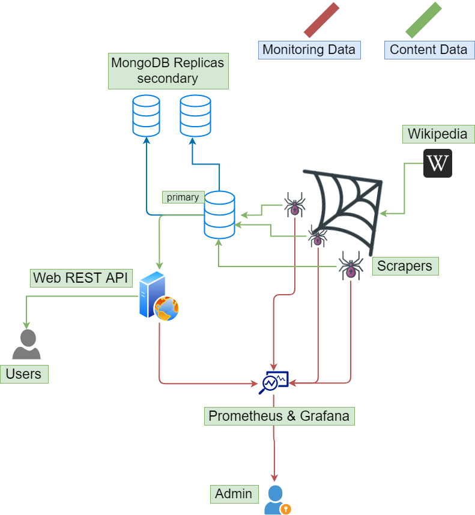
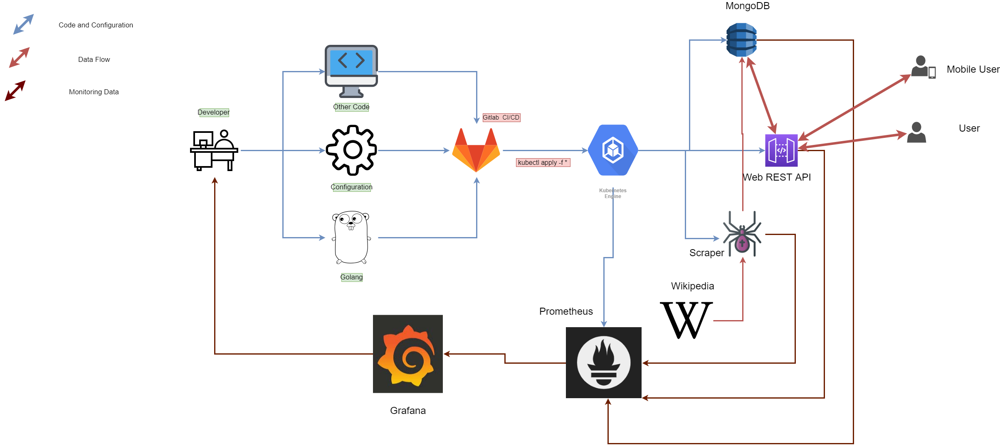
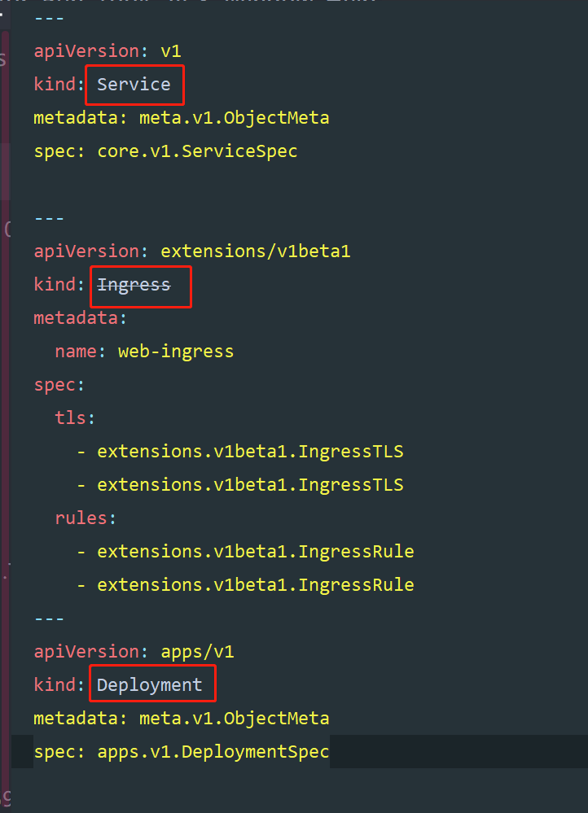
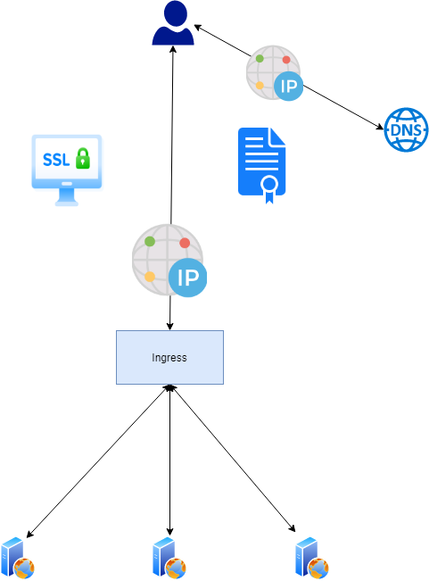
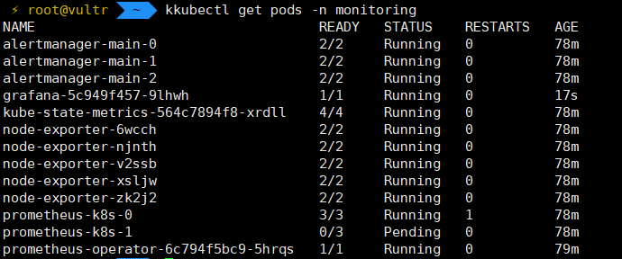
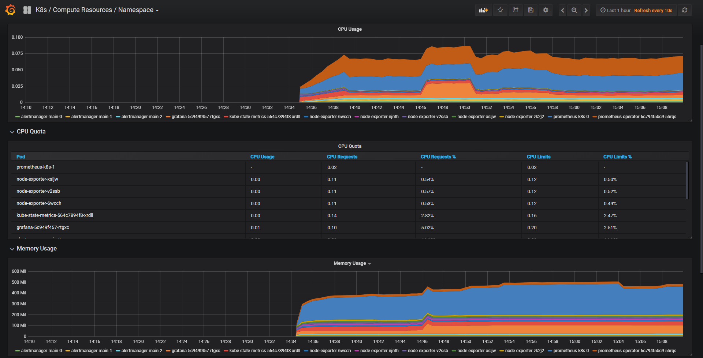
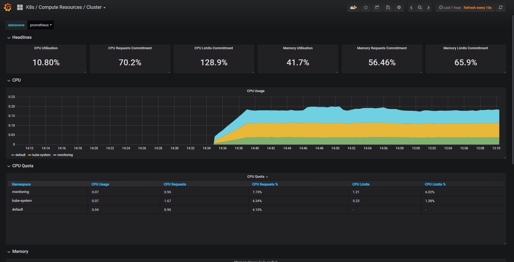

# A Web REST API Service based on Cloud Native & Micro Service----The Complete Guide

This Repository will explain the procedure that how to build a rest api service 
from scratch

The architecture of this project is here.



## And this project stack are:

- GoLang
  - web
    - http server
    - jwt & RSA encryption
    - let's encrypt certificate
  - Scraper
    - http request
    - html parsing
    - data manipulating
- Database
  - mongoDB Replicas
  - connection pool management
- MongoDB
  - replicas for high availability
  - persistent storage
- Docker
  - image build & distribution
- Gitlab CI/CD tool
  - auto devOps script
- Kubernetes
  - cluster creation
  - container orchestration
  - application deployment
  - network orchestration
  - data persistent storage

The whole cluster are consist by several components
 called micro service, every component is a 
 separate project, and all the components work 
 together to provide a **bigger** service for 
 the outside users.


So I split the whole project into parts as follows:

1. Crawler 
   - It collect data from Wikipedia and store data into database
2. Database
   - Store the data from crawler and provide data for web front end, actually a rest api
3. Web REST API
   - Read data from database and sent it to the authenticated users
4. Kubernetes
   - Provide all the container orchestration service
   - manage all the network communication between containers
5. Monitoring
   - Prometheus can collect monitoring data from all containers
   - Grafana can visualize the data in turn from Prometheus 


## Check them out in these repositories:

- [Web](https://gitlab.com/lyncode/webfront)

- [Crawler](https://gitlab.com/lyncode/WebScraper)

# Kubernetes container orchestration Guide

this is the deployment part of the whole [micro-service](https://gitlab.com/lyncode/devops)

I will explain the basic pipeline how to use gitlab ci/cd to implement a fully 
automatically DevOps.

## Architecture
architecture

As shown, this is the bigger picture of the whole solution.

I will explain the components one by one:
### Database
``/database/boot.sh`` is use for set up the  replicas set MongoDB
```bash
#!/usr/bin/env bash
kubectl apply -f storageclass.yaml
kubectl apply -f headless.yaml
kubectl apply -f statefulset.yaml
sleep 180
kubectl cp initiate.js mongo-0:initiate.js
kubectl exec mongo-0 -- mongo load  initiate.js
```
which set up the `storageClass` for persistent storage, `headless` for service discovery
`statefulset` for the mongoDB(which is a stateful application)
the `initiate.js` is use for set up the mongoDB replicas set configuration.

Check the documents [**here**](database/README.md)!

more about MongoDB replicas set, you can check this.
[MongoDb Replication](https://docs.mongodb.com/manual/replication/)

### Web
``deployment.yaml`` is the configuration for our web rest api deployment.
it looks like this:

- Service
  - used inside the kubernetes, which allow 
  the [Ingress controller](https://kubernetes.io/docs/concepts/services-networking/ingress/) 
  to communicate with the worker 
  web [pods](https://kubernetes.io/docs/concepts/workloads/pods/pod/).
- [Ingress](https://kubernetes.io/docs/concepts/services-networking/ingress/)
  - it receive request from internet and transfer the traffic to the target pods
- Deployment
  - it's a declarative statement that ask the kubernetes to deploy some specific application


#### HTTPS & TLS & Let's Encrypt
For security purpose we should enable https to our application.

So you should buy a domain and get a free certificate from let's encrypt.

I buy a cheap domain from `google domain` and 
the [**acme.sh**](https://github.com/Neilpang/acme.sh)
 is a very simple way to get a free certificate

### Scraper
like the web api, the scraper also deployed as 
a [Deployment](https://kubernetes.io/docs/concepts/workloads/controllers/deployment/) 
in Kubernetes cluster.

### Monitoring

We using [Prometheus](https://prometheus.io/) 
and [Grafana](https://grafana.com/) to monitoring 
cluster performance. Prometheus responsible for data collection, Grafana
for data visualization and alert management.

Considering the complexity, we used the existed solution developed by coreOS, the Operator,
which is a [CRD](https://kubernetes.io/docs/concepts/extend-kubernetes/api-extension/custom-resources/),
that enable us to deployment a monitoring system more efficient and safe.
All you need to do is to execute the command

switch to folder monitor/, and 
```bash
kubectl create -f /manifist
```
the rest work of installing Grafana and Prometheus is auto. After a period of time ,
you can check a bunch of pods running under the namespace of monitoring.
.

then we use ``port-forward`` as the proxy to reach our Grafana to see what is inside the monitoring system
```bash
kubectl port-forward grafana-5c949f457-9lhwh -n monitoring 3000:3000
```
**caution: make the pod name is same as in the output**

after that, you just type ``localhost:3000`` in browser, then you get a grafana login page like this.


the default username and password are `admin@localhost` and `admin`

set your password then you can check all the monitoring metrics already set by default.



It covers a very rich visualization charts! you can easily monitoring your cluster performance.


But i do not recommend expose the monitoring system into public internet for security consideration.

Hope this guide helps you to build some cluster application.

# References:
[Kubernetes](https://kubernetes.io/)

[Docker](https://www.docker.com/)

[coreOS operator](https://coreos.com/operators/)

[MongoDB](https://www.mongodb.com/)

[Golang](https://golang.org/)

[REST-ful](https://martinfowler.com/articles/enterpriseREST.html)

[JWT](https://jwt.io/)

[RSA]((https://en.wikipedia.org/wiki/RSA_(cryptosystem))

[Prometheus](https://prometheus.io/)

[Grafana](https://grafana.com/)

[CI/CD](https://en.wikipedia.org/wiki/CI/CD)

[Gitlab CI/CD](https://docs.gitlab.com/ee/ci/)

[Let's Encrypt](https://letsencrypt.org/)

